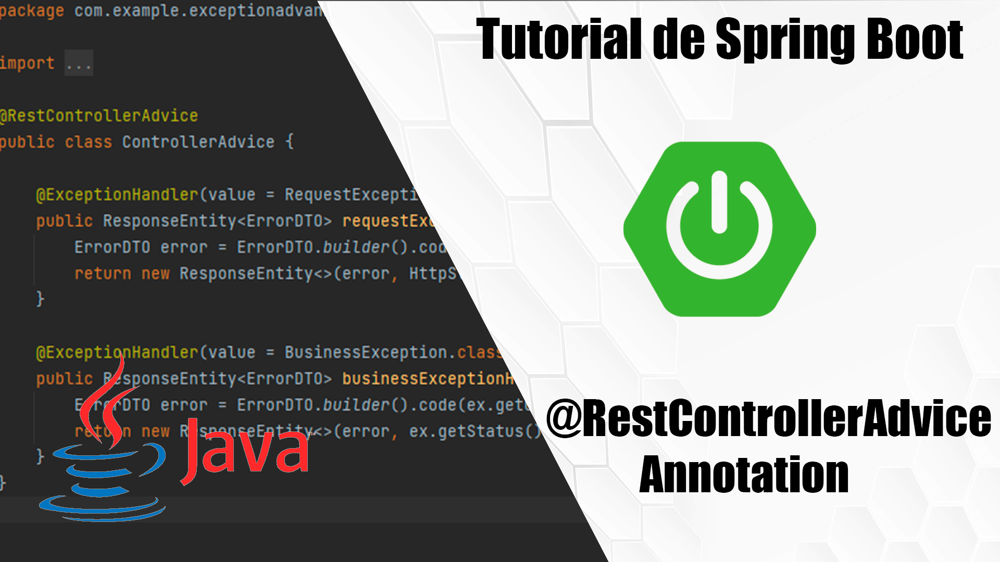
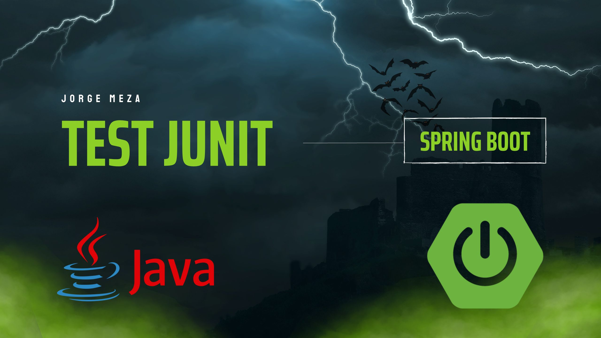

# Advanced Exception in Spring boot
Manejo de excepciones avanzado con spring boot utilizando @RestControllerAdviced

Documentación -> [Error Handling for REST with Spring](https://www.baeldung.com/exception-handling-for-rest-with-spring)

## Test junit de integración

Test aplicando Mvc. (Branch -> feature/test)

